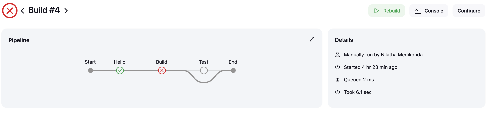

# FinGrow

FinGrow is a personal finance management application designed to improve financial well-being. It helps users manage various sources of income, regular expenses, and specific savings goals—like building an emergency fund or saving for vacations—through efficient tracking and budgeting systems.

This project follows Test-Driven Development (TDD) principles to ensure reliable, high-quality code.

## Features

**Login and Registration Pages:** Allow users to register and log in with a username and password.
**Home Page:**
- **Forms:**
  - Add a transaction.
  - Set a budget.
  - Define a savings goal.
- **Recent Transactions:** Display the five most recent transactions.
- **Generate Reports:**
  - Select report type from a dropdown (e.g., monthly or yearly).
  - Enter date range with From and To fields.
  - Submit the form to view the report for the selected period.
- **Alerts:** Display alerts when:
  - Spending exceeds the budget.
  - Savings goals reach 90%.

## TechStack

- **Typescript**: For type-safe development
- **Jest**: For unit testing
- **React:** Builds an interactive and dynamic user interface.
- **CSS for styling**: For styling and layout.

## Project Setup

Clone the respositories:
Clone both the frontend and backend repositories:

# Frontend Repository
git clone https://github.com/NikithaMedikonda/finGrow-frontEnd/tree/finGrow/frontend-part1

# Backend Repository
git clone https://github.com/NikithaMedikonda/finGrow/tree/fingrow/part-2


# Backend setup

1. Navigate to the Backend directory:
    ```sh
    cd /finGrow/tree/fingrow/part-2/
    ```
2. Install the dependencies:
    ```
    npm install
    ```

3. Run backend with command:
    ```sh
    npm run dev
    ```

# frontend setup

1. Navigate to the Backend directory:
    ```sh
    cd /finGrow-frontEnd/tree/finGrow/frontend-part1/
    ```
2. Install the dependencies:
    ```
    npm install
    ```

3. Start the frontend application:
    ```
    npm start
    ```

4. Open your browser and navigate to:
    ```
     http://localhost:3000/
    ```


## Testing the App
Run the tests using Jest:

    npm test

## Integration Of Github in Jenkins.
1. Install Jenkins : https://www.jenkins.io/doc/book/installing/

### Jenkins Configuration
1. Install Required Plugins
2. Go to Manage Jenkins -> Manage Plugins -> Available.
  * GitHub Integration Plugin
  * Email Extension Plugin
Configure the git repo by creating the new pipeline providing the necessary details.

### Using Jenkins
1. Write the pipeline script from configure section.
2. Start building the project using `Build Now` option.

### Images of Genkins and GitHub Integration, Email, adn Coverage Threshold Verification.
#### Build Pass
public/Build pass.png
#### Build Fail
public/Build fail.png

#### Mail Sent for success.
public/email for success.png
#### Mail Sent for failure.
public/email for failure.png
#### Coverage for threshold met.
public/coverage covered.png
#### Coverage for threshold unmet.
public/coverage not met.png
